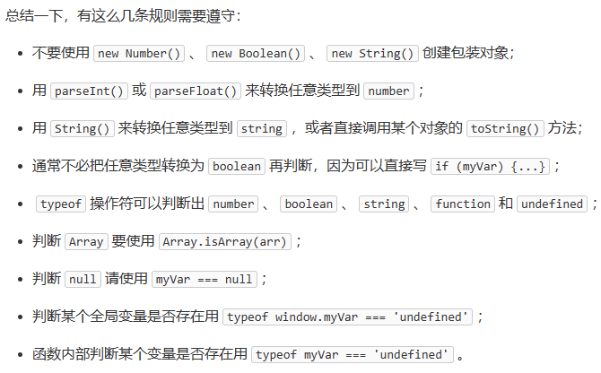
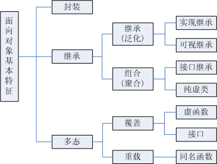
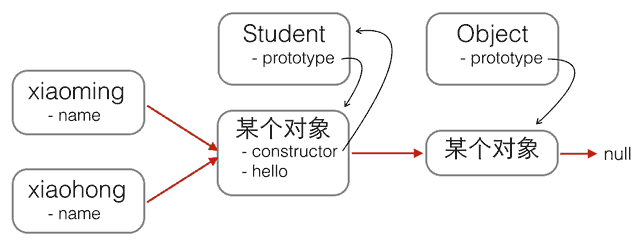

# JS 笔记
## 目录
- [JS 笔记](#js-笔记)
  - [目录](#目录)
  - [标准对象](#标准对象)
    - [1. Date](#1-date)
    - [2. RegExp](#2-regexp)
    - [3. JSON](#3-json)
  - [面向对象](#面向对象)
    - [基本概念](#基本概念)
    - [构造方式](#构造方式)
    - [原型继承](#原型继承)
    - [class继承](#class继承)
  - [浏览器](#浏览器)

## 标准对象
<div style="text-align:center;">
    
</div>

### 1. Date
```javascript
// Date类型为Object
/* CST中部时间 UTC协调世界时 GMT格林尼治标准时间 ISO 8601是格式 */
var now = new Date();
now; // Wed Jun 24 2015 19:49:22 GMT+0800 (CST)
now.getFullYear(); // 2015, 年份
now.getMonth(); // 5, 月份，注意月份范围是0~11，5表示六月
now.getDate(); // 24, 表示24号
now.getDay(); // 3, 表示星期三
now.getHours(); // 19, 24小时制
now.getMinutes(); // 49, 分钟
now.getSeconds(); // 22, 秒
now.getMilliseconds(); // 875, 毫秒数
now.getTime(); // 1435146562875, 以number形式表示的时间戳

/* 指定时间 */
var d = new Date(2015, 5, 19, 20, 15, 30, 123);
// 时间戳
console.log(Date.now());

/* 1.ISO8601转化为时间戳
   2.时间戳转化为ISO8601 */
var d = Date.parse('2015-06-24T19:49:22.875+08:00');
var d = new Date(1435146562875);
```

### 2. RegExp
<u>基础正则表达式</u>：注意转义字符；\
<u>精准匹配</u>
```javascript
// 写法
var re1 = /ABC\-001/;
var re2 = new RegExp('ABC\\-001');

// 测试方法
re.test('-001'); 

// 应用
// 切分
'a,b;; c  d'.split(/[\s\,\;]+/);
// 分组 - 使用 （）
var re = /^(\d{3})-(\d{3,8})$/;
re.exec('010-12345'); // ['010-12345', '010', '12345']
re.exec('010 12345'); // null
// 非贪婪匹配 - 使用 ？
var re = /^(\d+?)(0*)$/;
re.exec('102300'); // ['102300', '1023', '00']
// 标志：/g全局搜索 /i忽略大小写 /m多行匹配
var s = 'JavaScript, VBScript, JScript and ECMAScript';
var re=/[a-zA-Z]+Script/g;
re.exec(s); // ['JavaScript']
re.lastIndex; // 10
re.exec(s); // ['VBScript']
re.lastIndex; // 20
```

### 3. JSON
JavaScript Object Notation的缩写，数据交换格式，JS的子集 \
必须用双引号
```javascript
// 序列化 - 按缩进输出
var s = JSON.stringify(someObject, null, ' ');
console.log(s);
// 反序列化
```

## 面向对象
### 基本概念
<div style='text-align:center'>
    
</div>
<s><b>类，实例</b></S>:
不基于类-实例，而是基于原型。JavaScript的原型链和Java的Class区别就在，它没有“Class”的概念，所有对象都是实例。 <br>
<b>原型链</b>：原型链过长，访问时间变慢。<br>
<pre>
    <span>foo ----> Function.prototype ----> Object.prototype ----> null</span>
</pre>
<div style='text-align:center'>
    
</div>

### 构造方式
[示例代码](src/script/oop-create.js)
### 原型继承
### class继承
关键字<code>class</code>从ES6开始正式被引入到JavaScript中 <br>
现在用还早了点，因为不是所有的主流浏览器都支持ES6的class。如果一定要现在就用上，就需要一个工具把class代码转换为传统的prototype代码，可以试试Babel这个工具。<br>

## 浏览器
兼容问题：ES6 \
<b>浏览器对象</b>：window, navigator... \
navigator的信息可以很容易地被用户修改，所以JavaScript读取的值不一定是正确的；正确的方法是充分利用JavaScript对不存在属性返回undefined的特性，直接用短路运算符||计算
